# Hi, I’m Shubham 👋

**I build things that solve problems — sometimes polished, sometimes experimental.**  
I follow my curiosity: apps, libraries, automations, infra, browser extensions, ML/AI experiments, and data tooling.

---

---

## 🧐 About Me

- 🔭 **What I build:** production apps, small utilities, automations, libraries, infra scripts, browser extensions, data tools, and ML/AI experiments.  
- 🌱 **Experience & focus areas:** deep learning (ResNet and CNN-based models), NLP pipelines, computer vision (classification, detection, preprocessing with OpenCV), transfer learning, PyTorch/TensorFlow workflows, model serving and small web apps (FastAPI/Streamlit).  
- 👯 **Open to:** collaborations across frontend, backend, data, automation, and ML/AI projects.  
- 💬 **Ask me about:** Python, JavaScript, APIs, automation, model training & evaluation, transfer learning, and deploying small ML services.

---

## 🚀 Featured Projects

- 🛍️ **[smart-shopper-ai](https://github.com/Shubham-275/smart-shopper-ai)** — Python ML + app structure: models, notebooks, and a demo-ready layout. Good example of taking data → model → simple app.  
- 📄 **[Chatpdf](https://github.com/Shubham-275/Chatpdf)** — Client-side PDF/web utility (jsPDF & html2canvas). Example of frontend tooling and file-export UX.  
- 💰 **[Investment-Management-](https://github.com/Shubham-275/Investment-Management-)** — Python scripts + datasets for portfolio & crypto/mutual-fund analysis. Shows data processing and analysis tooling.  
- 🔧 **Focus-Pulse** *(Private Demo)* — Chrome extension for focus/time tracking with charting. Can demo or extract a public demo on request.

---

## 🛠️ Experimental Lab

A few more projects and automation experiments I maintain:

- **Shubham-binance-bot** (private) — trading automation and scripts (Python).  
- **Pdf** (private) — HTML/JS PDF helper/extension.  
- **AI_agent** (private) — modular Python agent and utility functions.

---

## 📊 GitHub Stats

  

---

### 📫 Reach Me

  
  

---
